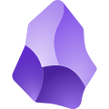

  

<h1 align="center">grayveins</h1>

<em>Engineering systems at the intersection of software, finance, and fitness.</em>

  
  

---

### About Me

- Computer Science Undergraduate Student
- Software Engineering; interested in fintech, trading, startups, and ML
- Productivity-maxxing with **Neovim**, **Linux**, and **minimal workflows**
- Bodybuilding, Powerlifting, music lover, and motorcycle rider
- Currently building something...

---

### Favorite Tech Stack

<blockquote>Tools</blockquote>

<table>
  <tr>
    <td align="center"> Linux</td>
    <td align="center"> Neovim</td>
    <td align="center"> i3WM</td>
    <td align="center"> Obsidian</td>
    <td align="center"> Notion</td>
    <td align="center"> Git</td>
  </tr>
</table>

<blockquote>Languages & Frameworks</blockquote>

<table>
  <tr>
    <td align="center"> Python</td>
    <td align="center"> JavaScript</td>
    <td align="center"> C++</td>
    <td align="center"> React</td>
    <td align="center"> PostgreSQL</td>
    <td align="center"> Docker</td>
  </tr>
</table>

---

### Featured Projects

<table>
  <tr>
    <td align="center">
      <a href="https://github.com/grayveins/Coreva"><strong>Coreva</strong></a>
    </td>
    <td align="center">
      <a href="https://grayveins-portfolio-optimization-ai-streamlit-app-vbhxhb.streamlit.app">
        <strong>Portfolio Optimization AI</strong>
      </a>
    </td>
    <td align="center">
      <a href="https://www.tradingview.com/script/6V8mfP7x-Price-Action-Trader/">
        <strong>Price Action Trader (20 EMA Scalper)</strong>
      </a>
    </td>
  </tr>

  <tr>
    <td>
      A full-stack fitness & coaching platform focused on structured training,
      nutrition logic, and scalable client management.
      Built with long-term SaaS vision in mind.
    </td>
    <td>
      A GPT-powered Streamlit app for optimizing S&P 500 portfolios using
      CAPM and Black-Litterman models.
    </td>
    <td>
      A TradingView strategy script for 1–5 min scalping using EMA, ATR,
      price action, and strict 1:2 risk-reward logic.
    </td>
  </tr>

  <tr>
    <td align="center">
      
    </td>
    <td align="center">
      
    </td>
    <td align="center">
      
    </td>
  </tr>

</table>

---

### Now Playing

---

