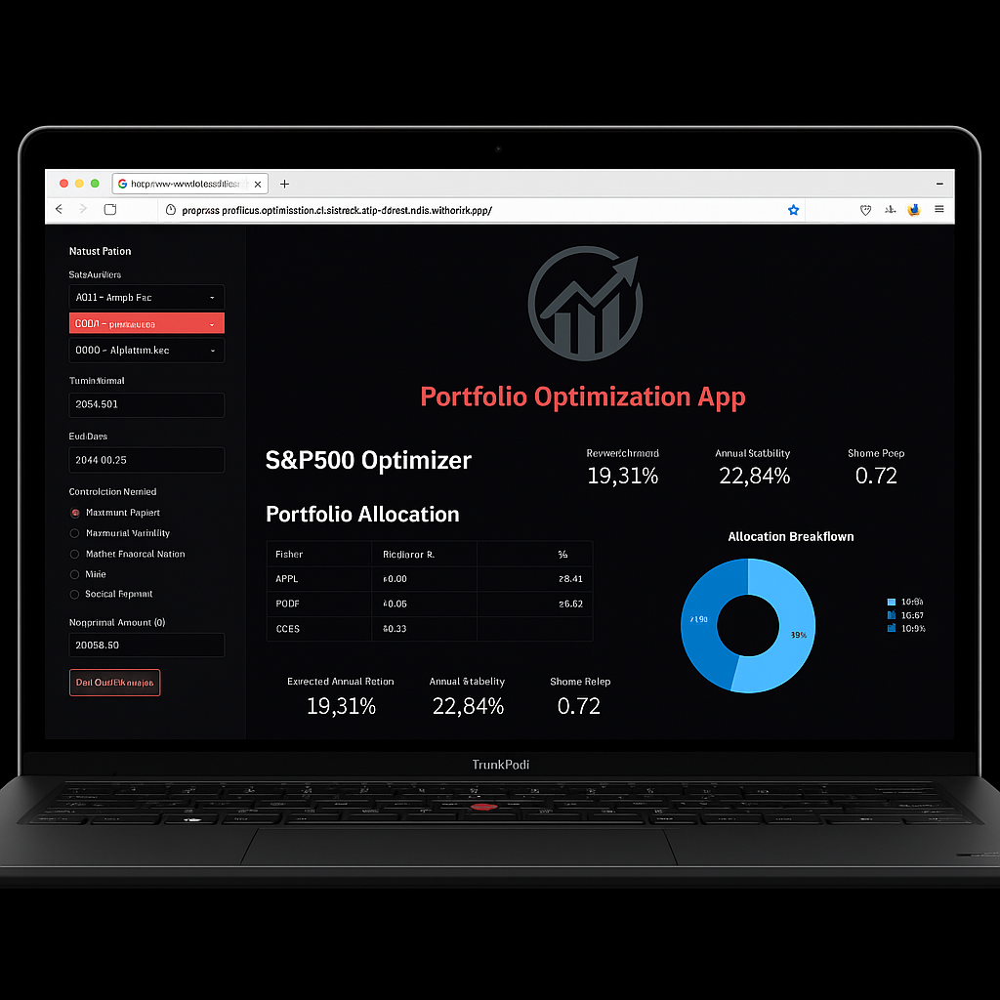

  

<h1 align="center">grayveins</h1>

<em>Clean code. Clear ideas. Always building something new.</em>

  
  

---

### About Me

- 💻 Aspiring full-stack developer based in **Toronto**
- 📈 Fintech & AI enjoyer; interested in trading, startups, and ML
- ⚙️ Productivity-maxxing with **Neovim**, **Linux**, and **minimal workflows**
- 🏋️‍♂️ Powerlifter, music lover, and motorcycle rider
- 🔭 Currently building [**Portfolio Optimization AI**](https://grayveins-portfolio-optimization-ai-streamlit-app-vbhxhb.streamlit.app/) – a smart, GPT-powered S&P500 portfolio tool

---

### Favorite Tech Stack

<blockquote>Tools</blockquote>

<table>
  <tr>
    <td align="center"> Linux</td>
    <td align="center"> Neovim</td>
    <td align="center"> i3WM</td>
    <td align="center"> Obsidian</td>
    <td align="center"> Notion</td>
    <td align="center"> Git</td>
  </tr>
</table>

<blockquote>Languages & Frameworks</blockquote>

<table>
  <tr>
    <td align="center"> Python</td>
    <td align="center"> JavaScript</td>
    <td align="center"> C++</td>
    <td align="center"> React</td>
    <td align="center"> PostgreSQL</td>
    <td align="center"> Docker</td>
  </tr>
</table>

---

### Featured Projects

<table>
  <tr>
    <td align="center"><a href="https://grayveins-portfolio-optimization-ai-streamlit-app-vbhxhb.streamlit.app">Portfolio Optimization AI</a></td>
    <td align="center"><a href="https://www.tradingview.com/script/6V8mfP7x-Price-Action-Trader/">Price Action Trader (20 EMA Scalper)</a></td>
  </tr>
  <tr>
    <td>A clean, GPT-powered Streamlit app to optimize S&P500 portfolios using CAPM and Black-Litterman.</td>
    <td>A TradingView strategy script built for 1–5 min scalping using EMA, ATR, price action, and 1:2 R:R logic.</td>
  </tr>
  <tr>
    <td></td>
    <td></td>
  </tr>
</table>

---

### Now Playing

---

